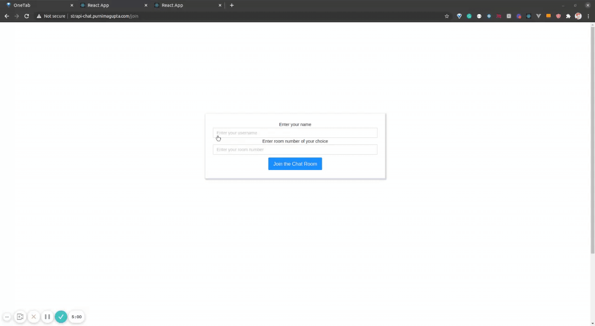

# Strapi Chat UI Forum Client

## Built using:
- ReactJS (create-react-app)
- Socket.IO (client)
- Requires [backend chat server](https://github.com/strapi-blog/strapi-chat-backend)

## Deployed on

Heroku. Watch the app in action [here](https://strapi-chat.purnimagupta.com)

### Prerequites to run the app:

- Install Nodejs
- Install npm 
- Fork and clone the repo `git clone git@github.com:strapi-blog/strapi-chat-ui.git`
- Fork and clone the backend server `git clone https://github.com/strapi-blog/strapi-chat-backend`
- Install dependencies by running `npm install` on terminal.
- Start the Server `npm run start`
    - This runs the app in the development mode.
        Open [http://localhost:3000](http://localhost:3000) to view it in the browser.
